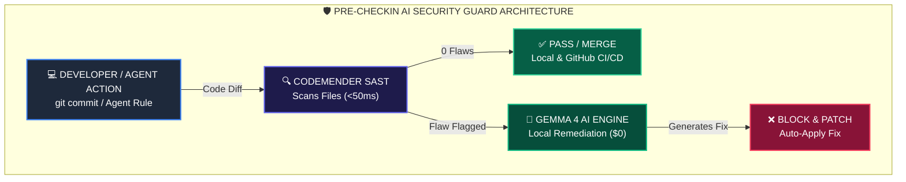

# 🛡️ Pre-Commit Security Guard: CodeMender + Gemma 4

## 📌 Post Copy (Practioner Voice)

A vulnerability caught in pre-commit takes 30 seconds to fix. The same vulnerability caught in production takes 3 days.

Most security tools flag flaws days after code is merged, when developers have already lost context.

I built a local pre-commit guard combining **CodeMender static tools**, **Gemma 4 AI remediation**, **Agent Skills**, and **GitHub Actions**.

Here is how the hybrid setup works:

1. **Agent Skills Rule (`AGENTS.md`)**: A persistent rule in the agent workspace forces the AI assistant to run a security audit whenever I request a code check-in.
2. **Detection (CodeMender MCP)**: CodeMender SAST scans modified files in < 50ms, flagging exact line numbers for SQLi, hardcoded secrets, or unsafe execution.
3. **Remediation (Gemma 4 Engine)**: Instead of sending code to a cloud API (which adds cost and latency), the flagged code snippet is passed locally to Gemma 4 to auto-generate a prepared statement or secure refactor in < 1s.
4. **CI/CD Enforcement (GitHub Actions)**: A `.github/workflows/codemender_gemma4_ci.yml` workflow re-audits every `push` and Pull Request remotely.

Why this approach works well:
- $0 Token Cost: Runs locally on device without cloud model API fees on every commit.
- Privacy: Proprietary source code never leaves the workstation.
- Dual-Layer Security: Protected locally at the keyboard via Agent Skills and remotely in GitHub CI/CD.

CodeMender catches the bug. Gemma 4 writes the fix locally. Agent Skills & GitHub Actions enforce it everywhere.

---

## 🛠️ How We Implemented This

### 1. Persistent Agent Skill / Rule (`AGENTS.md`)
Added a workspace rule instructing the AI pair programmer:
```markdown
# AGENTS.md
- Pre-Checkin Rule: Always execute `python3 codemender_gemma4_pipeline.py` before running commit or check-in commands. Block check-in if flaws are detected.
```

### 2. GitHub Actions CI/CD Pipeline (`.github/workflows/codemender_gemma4_ci.yml`)
Configured automated remote verification on every push:
```yaml
name: CodeMender + Gemma 4 Security CI/CD
on: [push, pull_request]
jobs:
  security-audit:
    runs-on: ubuntu-latest
    steps:
      - uses: actions/checkout@v4
      - uses: actions/setup-python@v5
        with: { python-version: '3.12' }
      - run: python3 codemender_gemma4_pipeline.py .
```

---

## 📐 System Architecture Diagram


