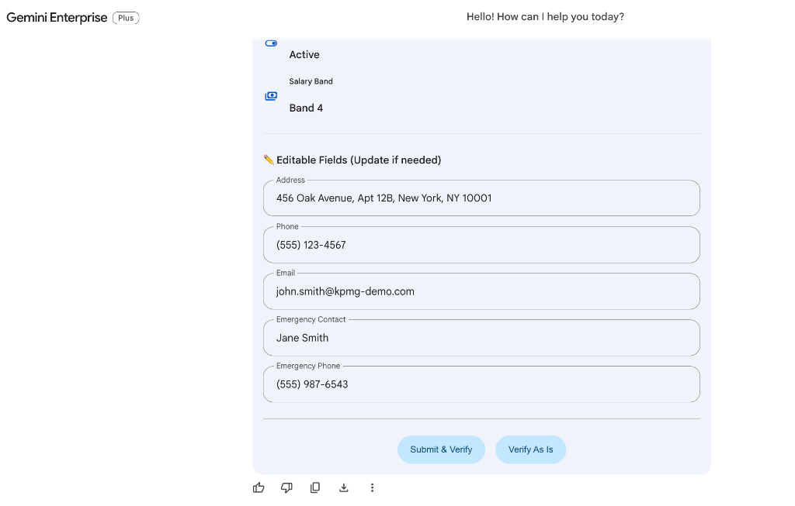

# Employee Verification Agent

An extensible multi-agent architecture for employee verification using **A2UI**, **A2A**, and **Google ADK** deployed to **Gemini Enterprise** with a **BigQuery** backend.

## Architecture

```
employee_verification/
├── agents/                          # Agent definitions (add new agents here)
│   └── employee_verification_agent/
│       ├── agent.py                 # Agent: tools, prompts, A2UI schema
│       └── executor.py              # A2A executor: handles UI actions + chat
│
├── tools/                           # Shared tool library with registry
│   ├── __init__.py                  # Central tool exports
│   ├── registry.py                  # Tool metadata catalog
│   ├── lookup_employee.py           # Tool: BQ SELECT employee records
│   ├── update_employee_field.py     # Tool: BQ UPDATE (whitelist-controlled)
│   └── verify_employee.py           # Tool: BQ UPDATE verified=true
│
├── examples/0.8/                    # A2UI JSON examples (guide LLM output)
│   ├── employee_verification_form.json  # Editable form with TextInput
│   ├── employee_list.json               # Search results list
│   ├── verification_success.json        # Success confirmation card
│   └── action_confirmation.json         # Modal confirmation
│
├── scripts/
│   └── setup_bigquery.py           # Creates BQ dataset + table + mock data
│
├── data/                            # Data files (extensible)
├── deploy.py                        # Deployment to Agent Engine + GE
├── .env                             # Environment configuration
└── pyproject.toml                   # Python dependencies
```

## How It Works

1. **Employee asks**: "Verify my employment" or "Find John Smith"
2. **Agent calls** `lookup_employee` → queries BigQuery
3. **A2UI form** is rendered with:
   - Read-only fields: name, ID, title, department, manager, hire date, status
   - Editable TextInput fields: address, phone, email, emergency contact
   - "Submit & Verify" and "Verify As Is" buttons
4. **Employee edits** fields and clicks submit
5. **Agent calls** `update_employee_field` for changed fields, then `verify_employee`
6. **Success card** is displayed



## Adding New Agents

1. Create a new directory: `agents/my_new_agent/`
2. Add `agent.py` (define tools, prompts) and `executor.py` (A2A handler)
3. Add A2UI examples in `examples/0.8/`
4. Create a deployment script or extend `deploy.py`

## Adding New Tools

1. Create a new file in `tools/` (e.g., `tools/my_new_tool.py`)
2. Add metadata entry in `tools/registry.py`
3. Import in `tools/__init__.py`
4. Add to the relevant agent's `tools=[...]` list

## Setup & Deployment

### Prerequisites
- Google Cloud Project with billing, Vertex AI, and Gemini Enterprise enabled
- `gcloud` CLI authenticated
- `uv` installed (recommended)
- OAuth 2.0 credentials configured (see working_a2ui_poc README for details)

### Step 1: Install dependencies
```bash
cd code/KPMG/employee_verification
uv sync
source .venv/bin/activate
```

### Step 2: Configure .env
Already configured with:
```
PROJECT_ID=kpmg-452019
LOCATION=us-central1
STORAGE_BUCKET=gs://ge_agent1
GEMINI_ENTERPRISE_APP_ID=gemini-enterprise-17768743_1776874364297
AGENT_AUTHORIZATION=projects/445897182778/locations/global/authorizations/combined-auth-v1
```

### Step 3: Set up BigQuery
```bash
python scripts/setup_bigquery.py
```

### Step 4: Deploy
```bash
python deploy.py
```

### Step 5: Test in Gemini Enterprise
- Open Gemini Enterprise in your GCP console
- Authorize the agent if prompted
- Try: "Verify my employment" or "Find John Smith"

## Tool Registry

The tool registry (`tools/registry.py`) provides metadata for management:
```python
from tools.registry import get_tools_by_tag, get_tool_metadata

# Find all read tools
read_tools = get_tools_by_tag("read")

# Get metadata for a specific tool
meta = get_tool_metadata("lookup_employee")
```

## Editable vs Protected Fields

| Editable (Employee can update) | Protected (Contact HR) |
|-------------------------------|----------------------|
| address | employee_id |
| phone | name |
| email | title |
| emergency_contact | department |
| emergency_phone | hire_date |
| | employment_status |
| | manager |
| | salary_band |
