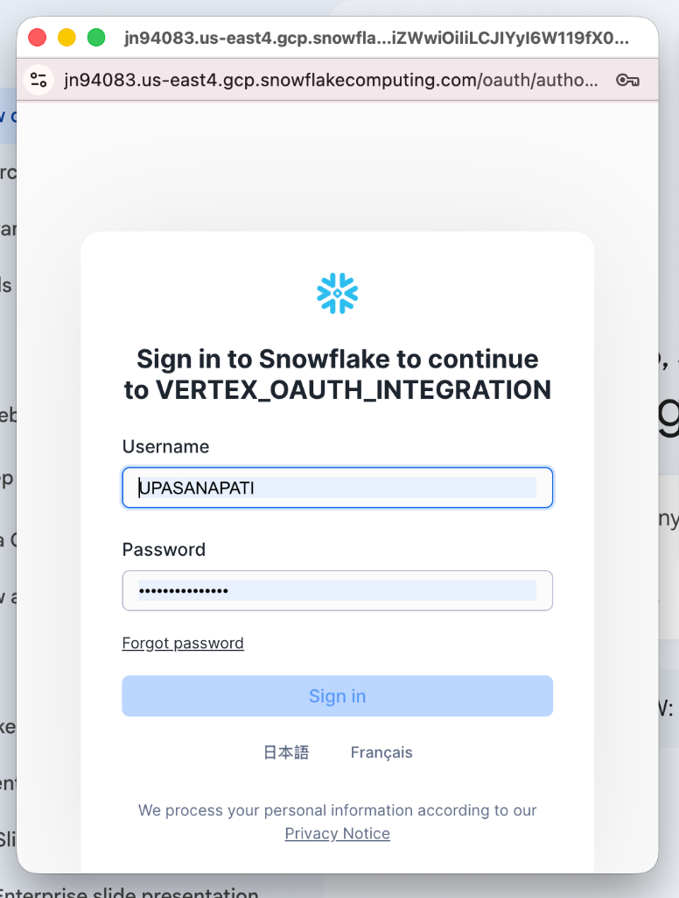
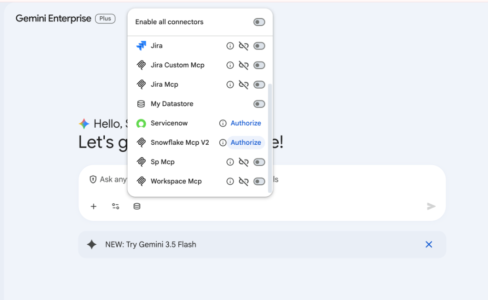
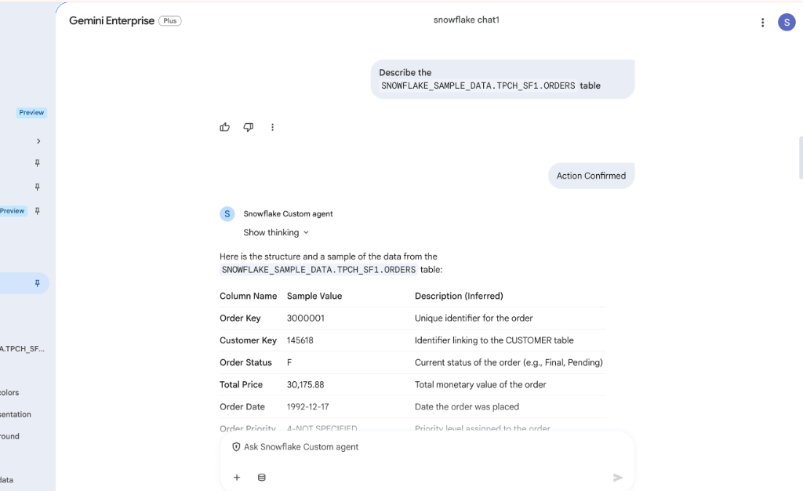

# Snowflake MCP Proxy Server ❄️

A Model Context Protocol (MCP) server that enables Large Language Models (such as Gemini Enterprise and Custom Agents) to directly query and manage your **Snowflake Data Warehouse** using natural language and SQL.

---

## 📦 Overview

The **Snowflake MCP Proxy Server** is a containerized Node.js express application. It implements the stable MCP standard over HTTP, serving as a robust interface for standard MCP clients. It exposes database metadata discovery, read-only query execution, schema-writing utilities, and Snowflake's state-of-the-art **Cortex Analyst (Natural Language to SQL)**.

---

## 🛡️ Security Design: Read-Only & Destructive Hints

To provide a premium, frictionless user experience under Gemini Enterprise (Vertex AI Search and Conversation), this proxy implements standard tool-level **Read-Only** and **Destructive** annotations:

* **Frictionless Read Operations**: Non-altering tasks—such as listing tables, using Cortex Analyst, or querying databases with standard SELECT commands—are annotated with `readOnlyHint: true`. This allows Gemini to run background queries instantly **without interrupting you with popup confirmations**.
* **Secure Destructive Guards**: Modifying queries (e.g., INSERT, UPDATE, DELETE, ALTER, DROP) are routed to `execute_sql` which is annotated with `destructiveHint: true`. This triggers the client-side safety confirmation prompt, preventing accidental writes or database schema alteration without your explicit consent.

---

## 🛠️ Supported MCP Tools

| Tool Name | Description | Annotations | Safety Guard / Rules |
| :--- | :--- | :--- | :--- |
| `execute_sql` | Executes standard database SELECT, WITH, SHOW, DESCRIBE, EXPLAIN, or USE commands. Bypasses approval prompts. | `readOnlyHint: true`<br>`destructiveHint: false` | **Enforced Read-Only**: Will reject any query starting with write-based keywords (e.g., `DROP`, `DELETE`, `INSERT`). |
| `execute_destructive_sql` | Executes arbitrary SQL commands including modifications, inserts, and schema DDL. | `readOnlyHint: false`<br>`destructiveHint: true` | **User Approvals Required**: Prompts a UI verification dialog before executing. |
| `list_tables` | Lists all tables inside a specified schema. Bypasses approval prompts. | `readOnlyHint: true`<br>`destructiveHint: false` | Safe metadata lookup. |
| `cortex_search` | Uses Snowflake Cortex Analyst to execute natural language questions via a Semantic Model (`.yaml`). Bypasses approval prompts. | `readOnlyHint: true`<br>`destructiveHint: false` | Powered by Snowflake's native NL2SQL engine. |

---

## ⚙️ Configuration

The server is configured using environment variables. Create a `.env` file in the root of the `snowflake-mcp-server` directory for local development:

| Variable | Description | Default / Example |
| :--- | :--- | :--- |
| `PORT` | The port the Express HTTP server listens on. | `8080` |
| `SNOWFLAKE_ACCOUNT` | Your Snowflake Account Identifier. | `dikgrbu-tv54598` |
| `SNOWFLAKE_USER` | Username for service account authentication. | `upasanapati` |
| `SNOWFLAKE_PASSWORD` | Password for the service account username. | `********` |
| `SNOWFLAKE_CLIENT_ID` | Your Custom OAuth Application Client ID. | `your_snowflake_client_id` |
| `SNOWFLAKE_CLIENT_SECRET` | Your Custom OAuth Application Client Secret. | `your_snowflake_client_secret` |
| `SNOWFLAKE_WAREHOUSE` | The virtual warehouse to compute queries. | `COMPUTE_WH` |
| `SNOWFLAKE_DATABASE` | Default active database. | `SNOWFLAKE_SAMPLE_DATA` |
| `SNOWFLAKE_SCHEMA` | Default active schema. | `PUBLIC` |

---

## 🚀 Getting Started

### Local Development

1. Navigate to the directory:
   ```bash
   cd byomcp/snowflake-mcp-server
   ```

2. Install dependencies:
   ```bash
   npm install
   ```

3. Start the server:
   ```bash
   npm start
   ```

4. Verify local health check:
   ```bash
   curl http://localhost:8080/
   # Output: Bulletproof Snowflake Pure-Express Library active.
   ```

---

## ☁️ Deployment to GCP Cloud Run

The project comes equipped with a standard `Dockerfile` and `deploy.sh` script to facilitate deployment to Google Cloud Run using **Cloud Build** (no local Docker daemon required).

### Automating Deployment

Run the deploy helper script to build and push the container:
```bash
chmod +x deploy.sh
./deploy.sh
```

---

## 🔌 Registering with Gemini Enterprise

To configure this server as a Custom MCP Datastore with secure delegated Snowflake OAuth:

1. Open your **Vertex AI Search and Conversation** Console.
2. Select **Data stores** ➡️ **Create data store** ➡️ **Custom MCP Server**.
3. Fill out the form using your deployed Cloud Run URL:

| Field | Entry Value |
| :--- | :--- |
| **MCP Server URL \*** | `https://<YOUR_CLOUD_RUN_URL>/mcp` |
| **Authorization URL \*** | `https://<YOUR_CLOUD_RUN_URL>/auth` |
| **Token URL \*** | `https://<YOUR_CLOUD_RUN_URL>/token` |
| **Client ID \*** | *Enter your real **Snowflake Custom OAuth Client ID*** |
| **Client Secret \*** | *Enter your real **Snowflake Custom OAuth Client Secret*** |
| **Scopes** | *The scopes authorized under your Snowflake custom integration (e.g., `session:role-any`)* |

4. Click **Login** to start the delegated OAuth flow. You will be securely redirected to your Snowflake login page to authenticate:
   
   

5. Once authenticated, save the connection and enable/authorize it inside the **Gemini Enterprise** chat connectors panel:

   

---

## 🧪 Example Prompts & Use Cases

### 1. Instant Read-Only Verification (Popup-Free)
> **"Describe the SNOWFLAKE_SAMPLE_DATA.TPCH_SF1.ORDERS table"**
*Expectation: Executes in the background instantly using `execute_sql` to output table description schemas, returning a clean, readable structure with zero popup interruptions.*



### 2. Natural Language Queries via Cortex Analyst
> **"Ask Cortex search in our Sample Sales model (@MY_STAGE/sales_model.yaml): 'What were the total sales last week?'"**
*Expectation: Instantly triggers `cortex_search` to return natural language insights translated from backend data.*

### 3. Secure Write Approval Check
> **"Execute a command in Snowflake to create a new empty log table called 'METRIC_RUNS'."**
*Expectation: Triggers `execute_sql` and prompts a client-side user confirmation box because it is marked destructive.*
