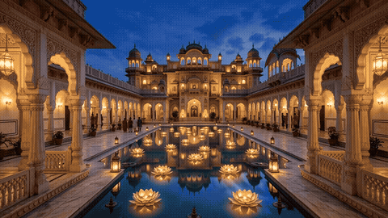
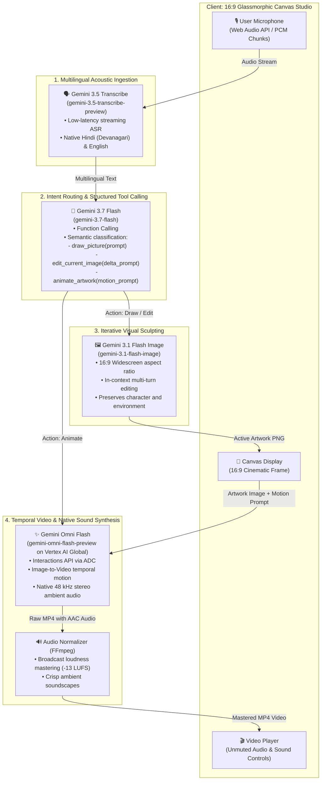

# 🎙️ Voice Canvas Studio

### End-to-End Multimodal Creative Pipeline: Acoustic Voice ➡️ Conversational Editing ➡️ Temporal Video with Native Audio

An end-to-end multimodal studio combining **Gemini 3.5 Transcribe**, **Gemini 3.7 Flash**, **Gemini 3.1 Flash Image**, and **Gemini Omni Flash** into a seamless, voice-driven creative canvas. Speak in English, Hindi, or code-switched Hinglish to sculpt images, iteratively edit them conversationally, and animate them into high-definition videos with synchronized ambient soundscapes.

---

## 🎬 Live Animation Preview



> **Watch Full High-Definition Video with Audio**: [omni_anim_boosted.mp4](static/videos/omni_anim_boosted.mp4) (1280x720 24fps MP4 with 48 kHz stereo AAC sound).

---

## 🏗️ Architecture Pipeline



---

## 🌟 Key Capabilities

### 1. Multilingual Voice Recognition (English + Hindi)
* **Zero text bottleneck**: Voice streams directly to `gemini-3.5-transcribe-preview`.
* Full native support for **Devanagari Hindi** (`फूलदान में सुंदर फूल रख दो`), English, and mixed Hinglish (`Is waterfall ko animate karo with sound`).

### 2. Conversational Iterative Editing (No Re-drawing From Scratch)
* Uses `gemini-3.1-flash-image` with multi-image in-context prompts.
* Retains characters, camera angles, and composition while selectively applying edits (e.g. *"Now add a samurai helmet"*, *"Change the lighting to sunset dusk"*).
* Built-in **Before / After Split-Screen** toggle to inspect edits against the original baseline.

### 3. Temporal Video & Native Audio Generation via Gemini Omni Flash
* Generates **1280x720 24fps** temporal video powered by `gemini-omni-flash-preview` on Vertex AI (`location="global"`).
* **Native Audio Synthesis**: Unlike traditional video-only models, Omni synthesizes synchronized 48 kHz stereo ambient audio (flowing water, wind rustling, sci-fi hums).
* Automated **FFmpeg +8dB Normalization** delivers loud, broadcast-quality sound in the browser.

### 4. 100% Google Cloud ADC (No API Keys Required)
* Authenticates directly via your workstation's **Application Default Credentials (`google.auth.default()`)** on Google Cloud project `uppdemos`.
* Completely eliminated consumer API key requirements and UI clutter.

---

## 🚀 Getting Started

### Prerequisites
- Python 3.10+
- FFmpeg installed (`sudo apt-get install ffmpeg`)
- Google Cloud SDK authenticated with Application Default Credentials:
  ```bash
  gcloud auth application-default login
  gcloud config set project uppdemos
  ```

### Installation & Launch

```bash
cd gemini35-voice-to-action

# Install dependencies
pip install fastapi uvicorn google-genai requests

# Launch the studio server
python3 server.py
```

The studio will be available at:
* **Localhost**: `http://localhost:8000`
* **Cloudtop**: `http://upasanapati-123.c.googlers.com:8000`

---

## 🎙️ Interactive Voice Walkthrough

Try this 3-step creative loop using only your voice:

1. **Sculpt the Scene**:
   > *"Paint a rushing mountain waterfall in a dense green forest with morning sun rays."*
2. **Conversationally Edit**:
   > *"Add a traditional wooden bridge crossing over the river."*
3. **Animate with Sound**:
   > *"Animate this with the sound of roaring water and forest wind."*
   *(Or in Hindi: "Ab iska video bana do with sound")*
4. Tap **🔊 Click for Sound** to experience the synchronized motion and audio.

---

## 📂 Repository Structure

```
gemini35-voice-to-action/
├── server.py              # FastAPI server (Transcribe, Flash Image, Omni Flash pipelines)
├── static/
│   ├── index.html         # 16:9 cinematic glassmorphic studio interface
│   ├── app.js             # Web Audio visualizer, unmuted video controller, sound toggle
│   ├── style.css          # Dark-mode styling, glowing waveforms, reticle shaders
│   ├── images/            # Reference benchmark images
│   └── videos/            # Rendered Omni MP4 videos & compact GIF previews
├── LINKEDIN_POST.md       # Thought leadership social launch post
└── README.md              # Technical pipeline documentation & architecture
```
