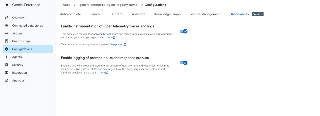
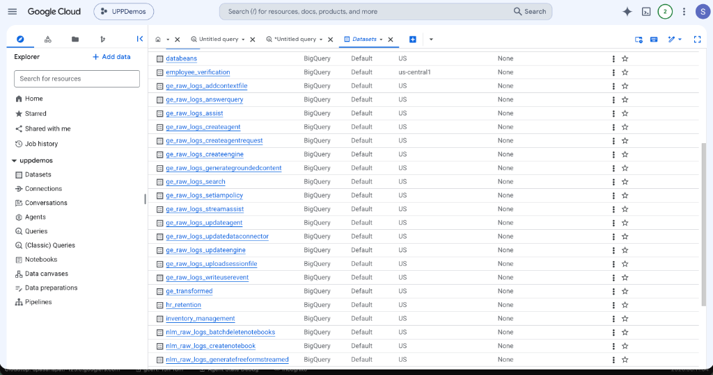
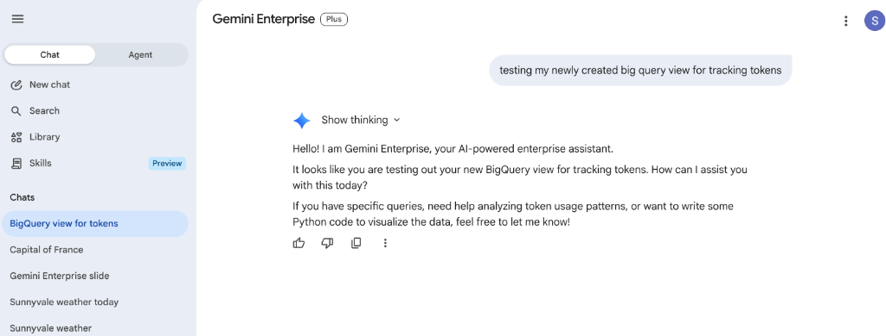
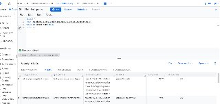

# Gemini Enterprise Observability & Token Capture Setup Guide

This guide walks you through setting up end-to-end observability for your Gemini Enterprise engines to capture user queries, user principals (emails), and input/output token counts in BigQuery.

---

## Architecture Overview

To get a complete audit trail, we combine two data sources using the **Trace ID**:
1.  **Token Usage**: Captured via OpenTelemetry traces stored in the `_Trace` observability bucket.
2.  **User & Query Text**: Captured via Cloud Logging (`gemini_enterprise_user_activity` logs) and exported to BigQuery.

A unified BigQuery **View** joins these sources in real-time.

---

## Prerequisites

Before starting, ensure you have:
*   A Google Cloud project with billing enabled (e.g., `uppdemos`).
*   The following APIs enabled:
    *   `observability.googleapis.com` (Observability API)
    *   `cloudtrace.googleapis.com` (Cloud Trace API)
    *   `logging.googleapis.com` (Cloud Logging API)
*   `gcloud` CLI installed locally (version 372.0.0 or newer).
*   BigQuery Admin and Discovery Engine Admin IAM roles.

---

## Step 1: Enable Observability on the Engine

You must enable observability on your Gemini Enterprise engine (app) so it emits traces and logs.

1.  In the Google Cloud Console, navigate to **Gemini Enterprise** (or **Search and Conversation**).
2.  Select your Engine/App.
3.  Go to **Configurations** -> **Observability** tab.
4.  Enable the following settings:
    *   **Enable instrumentation of OpenTelemetry traces and logs**
    *   **Enable logging of prompt inputs and response outputs** (Sensitive Logging)

> [!IMPORTANT]
> Sensitive logging must be enabled to capture the actual text of the user queries.




---

## Step 2: Set up Log Sinks to BigQuery

To export user activity logs to BigQuery:

1.  Navigate to **Logging** -> **Log Router** in the Cloud Console.
2.  Click **Create Sink**.
3.  Set the following parameters:
    *   **Sink Name**: `ge_raw_logs_streamassist`
    *   **Sink Destination**: BigQuery dataset (create a new dataset, e.g., `ge_raw_logs_streamassist`).
    *   **Build inclusion filter**:
        ```sql
        logName="projects/[PROJECT_ID]/logs/discoveryengine.googleapis.com%2Fgemini_enterprise_user_activity" AND jsonPayload.logMetadata.methodName="StreamAssist"
        ```
        *(Replace `[PROJECT_ID]` with your project ID).*

*(Optional)* Create a second sink for unary (non-streaming) queries:
*   **Sink Name**: `ge_raw_logs_assist`
*   **Sink Destination**: BigQuery dataset `ge_raw_logs_assist`.
*   **Filter**:
    ```sql
    logName="projects/[PROJECT_ID]/logs/discoveryengine.googleapis.com%2Fgemini_enterprise_user_activity" AND jsonPayload.logMetadata.methodName="Assist"
    ```

Once created, you will see the datasets in BigQuery:



---

## Step 3: Create Logging Link for Trace Data

To expose the OpenTelemetry trace spans in BigQuery, you need to create a link to the `_Trace` observability bucket.

Run this command in your terminal (authenticated to your project):

```bash
gcloud logging links create trace_link \
    --bucket=_Trace \
    --location=global \
    --project=[PROJECT_ID]
```

This will automatically create a read-only linked dataset in BigQuery named **`trace_link`** containing the `_AllSpans` view.

---

## Step 4: Create the Unified Real-Time View

Since the linked `trace_link` dataset is read-only, we create a unified view in a writeable dataset (e.g., `agent_analytics`).

1.  Go to **BigQuery** in the Cloud Console.
2.  Open the SQL Editor and run the following DDL to create the view:

```sql
CREATE OR REPLACE VIEW `[PROJECT_ID].agent_analytics.gemini_token_usage_by_user` AS
WITH user_logs AS (
  SELECT
    REGEXP_EXTRACT(trace, r'([^/]+)$') as trace_id,
    ANY_VALUE(jsonPayload.userIamPrincipal) as user_principal,
    ANY_VALUE(COALESCE(
      jsonPayload.request.query.text,
      (SELECT STRING_AGG(p.text, "\n") FROM UNNEST(jsonPayload.request.query.parts) p)
    )) as query_text
  FROM
    `[PROJECT_ID].ge_raw_logs_streamassist.discoveryengine_googleapis_com_gemini_enterprise_user_activity`
  WHERE
    jsonPayload.userIamPrincipal IS NOT NULL
  GROUP BY
    1
),
spans AS (
  SELECT
    trace_id,
    start_time,
    STRING(attributes['gen_ai.conversation.id']) as conversation_id,
    STRING(attributes['gen_ai.request.model']) as model,
    CAST(STRING(attributes['gen_ai.usage.input_tokens']) AS INT64) as input_tokens,
    CAST(STRING(attributes['gen_ai.usage.output_tokens']) AS INT64) as output_tokens
  FROM
    `[PROJECT_ID].trace_link._AllSpans`
  WHERE
    name LIKE "generate_content%"
    AND attributes['gen_ai.usage.input_tokens'] IS NOT NULL
)
SELECT
  s.start_time,
  u.user_principal,
  u.query_text,
  s.conversation_id,
  s.model,
  s.input_tokens,
  s.output_tokens
FROM
  spans s
LEFT JOIN
  user_logs u
ON
  s.trace_id = u.trace_id
```
*(Replace `[PROJECT_ID]` with your project ID).*

---

## Step 5: Verification (End-to-End Test)

1.  Go to the **Gemini Enterprise Preview** tab for your engine.
2.  Send a test query: *"testing my newly created big query view for tracking tokens"*.



3.  Wait 1–2 minutes for logs to propagate.
4.  Query the view in BigQuery:
    ```sql
    SELECT * 
    FROM `[PROJECT_ID].agent_analytics.gemini_token_usage_by_user` 
    ORDER BY start_time DESC 
    LIMIT 5
    ```
5.  Verify the output shows your query, user principal, model, and correct token counts.


