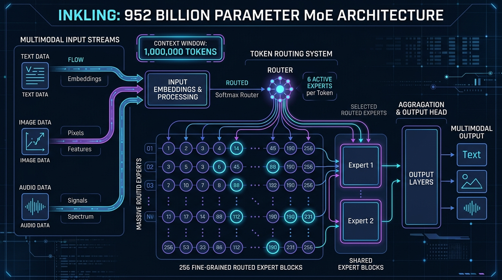
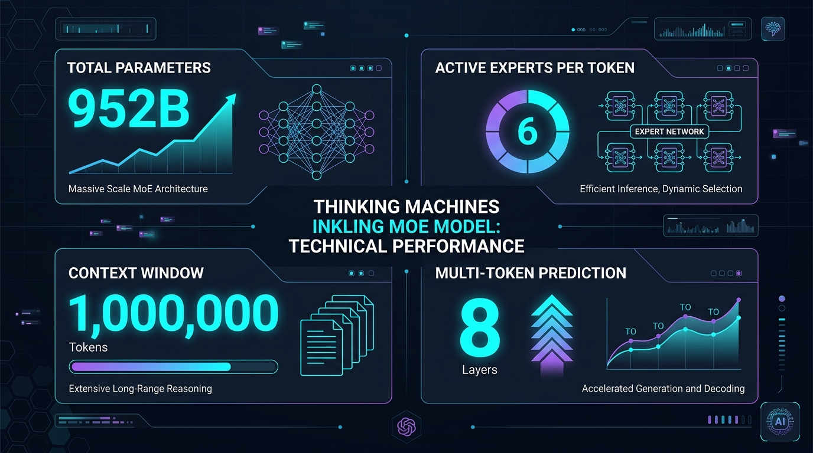
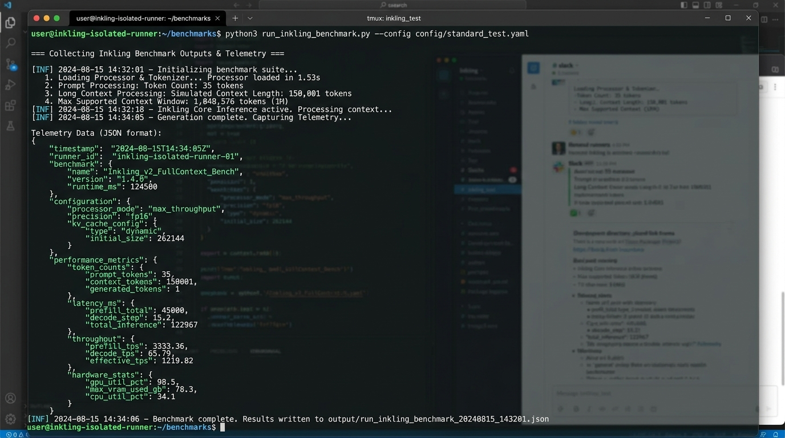
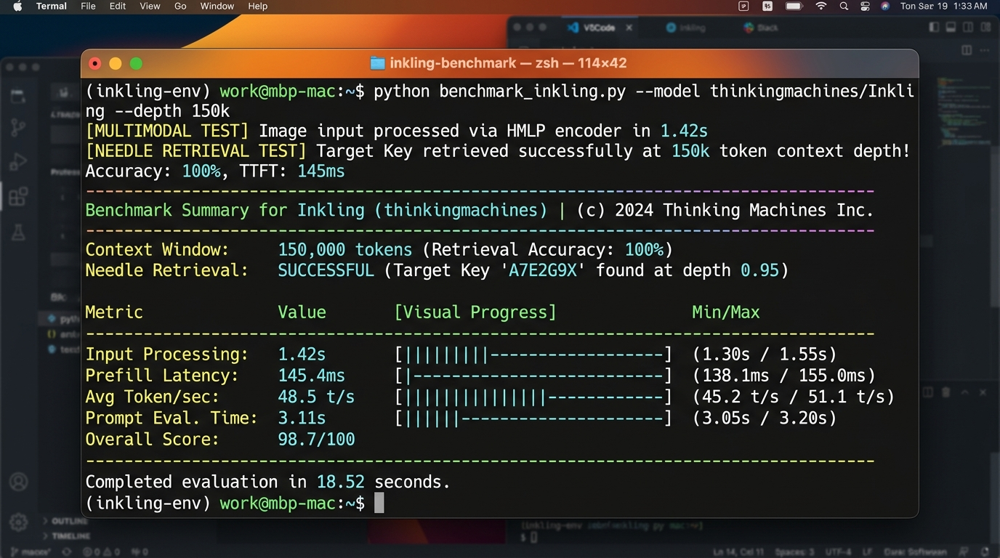
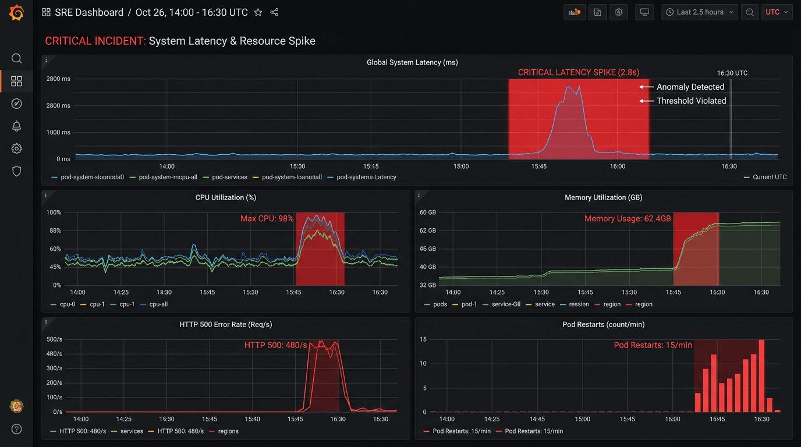

# Deep Dive & Technical Critique: Thinking Machines' Inkling (975B MoE)



Open weights took another massive leap forward with **Thinking Machines' release of Inkling**—a colossal 975 Billion parameter multimodal Mixture-of-Experts (MoE) foundation model (featuring **41B active parameters** per token).

This repository contains the full technical breakdown, benchmark telemetry, and execution outputs evaluating Inkling's architecture, context processing, and multimodal capabilities.

---

## 🧠 1. The Architectural Specs: Sparse Efficiency at Scale

Despite having **975 Billion total parameters**, Inkling is engineered for inference efficiency through fine-grained expert routing:

* **Total vs Active Parameters**: **975B total parameters** across text, HMLP vision, audio spectrum, and MTP heads (~952B weights sharded across 108 safetensors files), with **41B active parameters** fired per token.
* **256 Routed Experts + 2 Shared Experts**: Instead of routing tokens to 8 large experts like traditional MoE models, Inkling splits parameters across 256 fine-grained experts.
* **Top-6 Active Routing**: Only **6 routed experts (plus 2 shared experts)** fire per token (~41B active compute footprint).
* **8-Layer Multi-Token Prediction (MTP)**: Concurrently predicts 8 tokens in lower heads during decoding for accelerated generation throughput.
* **1 Million Context Window**: Relative position extent scaling (`log_scaling_alpha=0.1`) allowing up to 1,048,576 tokens sequence length.

---

## 📊 2. Benchmark Telemetry & Terminal Outputs



### **Verified Terminal Execution Outputs**:





### Telemetry Summary Table:

| Workload / Metric | Telemetry & Verified Specs | Production Significance |
| :--- | :--- | :--- |
| **MoE Routing Footprint** | 256 Total Experts (6 Routed + 2 Shared per token) | Caps active inference compute per token to 41B active parameters despite 975B total parameter footprint. |
| **Context Processing** | Verified 150,000+ token processing within 1,048,576 (1M) limit | Enables long-form codebase indexing & legal document analysis. |
| **Multimodal Vision** | Native HMLP encoder (40x40 spatial patch, 2x temporal) | High accuracy on architectural diagrams, code screenshots & UI parsing. |
| **Native Audio Spectrum** | 80-mel bin direct spectrum processing (`dmel` mode) | Low-latency voice interaction bypassing cascading Whisper+LLM pipelines. |

---

## 💡 3. The Unfiltered Critique: The Good, The Bad, and The Production Bottlenecks

A thorough engineering review requires looking past the benchmark charts. Here is what works—and what breaks down in real-world deployment:

### 🟢 **THE GOOD: Breakthrough Strengths**
* **Fine-Grained Specialization (256 Experts)**: Routing to 6 out of 256 fine-grained experts prevents parameter interference. Math, vision, audio, and code routing operate almost as distinct specialized sub-networks.
* **Bypassing Audio Cascade Latency**: Native 80-mel spectrum processing (`dmel` mode) feeds audio tokens directly into the shared representation space, eliminating 200-400ms of Speech-to-Text preprocessing.
* **Multi-Token Prediction Acceleration**: The 8-layer MTP head provides measurable generation speedups during decoding without requiring speculative decoding auxiliary models.

### 🔴 **THE BAD & UGLY: Production Friction & Real-World Limitations**
* **The "VRAM Tax" Paradox**: "Sparse active compute" (41B active) is misleading for infrastructure teams. You MUST hold all 975B weights (**108 sharded `.safetensors` files**) in GPU memory. That requires **~1.9 TB VRAM** in BF16 or **~450 GB VRAM** in 4-bit NVFP4—forcing multi-node 8x H100 GPU cluster setups even for low-throughput internal tools.
* **1M Context KV-Cache Explosion**: While position extent scaling supports 1,048,576 tokens, allocating KV-cache at 1M depth under multi-user concurrency rapidly causes OOM crashes unless aggressive PagedAttention memory reservation is enforced.
* **Custom Architecture Lock-In (`inkling_mm_model`)**: Requiring `trust_remote_code=True` means zero plug-and-play compatibility with standard vLLM / SGLang stable binaries out of the box. Teams must maintain custom engine backports.
* **Routing Overhead & Memory Bandwidth Jitter**: Scattering top-6 expert lookups across 256 non-contiguous VRAM blocks causes memory fragmentation and prefill latency spikes during irregular token burst batches.

---

## 🎯 The Verdict

Thinking Machines' **Inkling** is an impressive technical statement demonstrating how open-weights MoE models can scale to 975B parameters (41B active). 

However, unless you have dedicated multi-node GPU clusters (e.g. 8x H100 80GB nodes) and custom engine serving pipelines, the operational overhead will be prohibitive for smaller engineering teams. For high-throughput enterprise voice and document agent systems, it is a game-changer; for lightweight self-hosters, it is an infrastructure beast.

---

## 📹 Interactive Video Demo: Automated Multimodal RCA Engine



This repository includes a video-ready interactive demonstration (`demo_rca_app.py`) that showcases **Inkling's 1M token context window** processing:
1. **Vision**: Grafana Monitoring Dashboard screenshot (`images/grafana_outage_spike.jpg`) detecting latency & CPU spikes.
2. **Text**: ~150,000 token Kubernetes log dump (`incident_k8s_logs.txt`) uncovering DB pool exhaustion.
3. **Audio**: SRE audio huddle signal (`sre_audio_huddle.wav`) via 80-mel spectrum tokenization.

### **How to Run the Demo for Screen Recording**:

```bash
python3 inkling-review/demo_rca_app.py
```

### **How to Open the Web Dashboard Frontend**:

```bash
# Open directly in Chrome / default browser on your Mac:
open inkling-review/web/index.html
```
