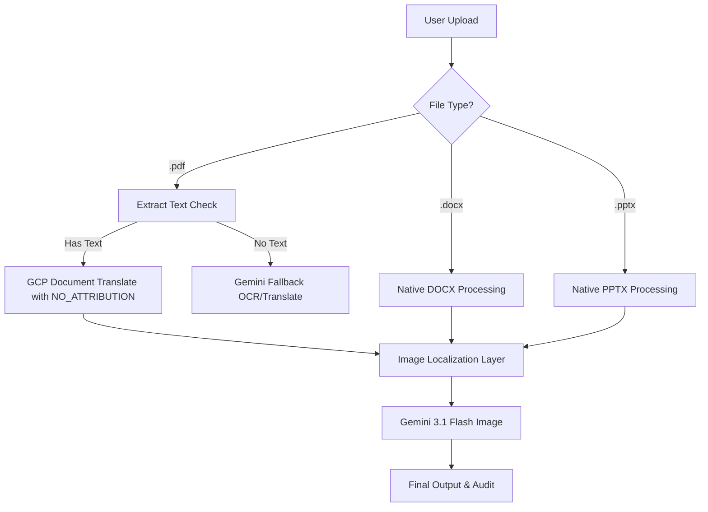

# 🚀 Financial Document Translation Agent (v4)

[](https://fastapi.tiangolo.com)
[](https://reactjs.org/)
[](https://vitejs.dev/)
[](https://deepmind.google/technologies/gemini/)

Expert document translation with **numerical precision**, **layout preservation**, and **terminology consistency**. This project handles complex financial reports across multiple formats, ensuring that both text and embedded graphics are perfectly localized.

---

## 🌟 Key Features

### 📄 Multi-Format Mastery
Seamlessly process and translate:
- **PDF Documents** (Vector and Scanned)
- **Word Documents** (`.docx`)
- **PowerPoint Presentations** (`.pptx`)

### 🧠 AI-Powered Image Localization
Leverages **Gemini 3.1 Flash Image** to:
- Detect text embedded within images, charts, and diagrams.
- Translate the text while preserving the original visual style, colors, and layout.
- Re-insert the translated image back into the document.

### 🔄 Hybrid Translation Pipeline
Combines the strengths of two world-class systems:
1. **Google Cloud Translation API**: Handles core text translation with layout preservation and glossary enforcement.
2. **Gemini Multi-Modal Fallback**: Automatically kicks in for scanned pages or documents with non-selectable text.

### 🏷️ Custom Attribution & Watermark Removal (`NO_ATTRIBUTION`)
By default, Google Cloud Translation API v3 applies a `"Machine Translated by Google"` watermark header to translated PDF pages. This version introduces full watermark control:
- **Default Behavior**: Configured out-of-the-box with `"customized_attribution": "NO_ATTRIBUTION"`, completely suppressing the watermark for clean internal and executive document generation.
- **Allowed API Values**: The Translation API backend validates attribution against a strict system allowlist:
  - `NO_ATTRIBUTION` — Completely suppresses the watermark header.
  - `Machine Translated by Google` — Standard Google Translate header (default).
  - `Machine Translated by Google Cloud` — Google Cloud branding header.
  - `Machine translated by Google - only for internal use` — Internal enterprise watermark.
  > ⚠️ **Important Gotcha**: Passing arbitrary custom strings (e.g. `"Translated by My Company"` or `"Translated by KPMG"`) is rejected by the API with `400 INVALID_ARGUMENT: Invalid customized attribution`.
- **UI Dropdown Selector**: Users can switch between any of the 4 attribution options directly from the header dropdown in the frontend.
- **Compliance**: Under [Cloud Translation Attribution Guidelines](https://cloud.google.com/translate/attribution#attribution_and_logos), removing the document watermark is allowed for internal, back-office workflows. When displaying to external end-users, attribution should be provided in the application UI.

---

## 🛠️ Architecture



---

## 🚀 Quick Start

### Prerequisites
- Python 3.10+
- Node.js & npm
- Google Cloud Project with **Cloud Translation API** enabled.

### Installation

1. **Clone and Navigate**:
   ```bash
   cd "UP_Demos/translation-v4"
   ```

2. **Setup Backend**:
   ```bash
   pip install -r requirements.txt
   ```

3. **Setup Frontend**:
   ```bash
   cd frontend
   npm install
   cd ..
   ```

### Running Locally

Start both services with a single command:
```bash
bash run.sh
```

- **Dashboard**: `http://localhost:5175`
- **API Endpoint**: `http://localhost:8002`

---

## 📁 Project Structure

| File/Folder | Description |
| :--- | :--- |
| `main.py` | ADK Agent definition and workflow instructions (local). |
| `translator_tool.py` | Core translation logic and Gemini image processing. |
| `audit_tool.py` | Multi-format text extraction utilities. |
| `server.py` | FastAPI backend orchestrator. |
| `frontend/` | React/Vite verification dashboard. |
| `adk_agent/` | **Vertex AI Agent Engine (Reasoning Engine)** package with A2A protocol and Gemini Enterprise A2UI iframes. |
| `adk_agent/agents/` | Agent definitions, components, and executors (`KPMGTranslationExecutor`). |
| `adk_agent/config/` | YAML configuration (`translation_assistant.yaml`) with skills, models, and dependencies. |
| `adk_agent/scripts/` | Deployment, local test simulation, and lifecycle management scripts. |

---

## 🤖 Vertex AI Agent Engine & Gemini Enterprise A2UI Integration

This project is deployed as an enterprise **ADK Agent** on **Vertex AI Agent Engine (Reasoning Engine)** and registered directly into **Gemini Enterprise (Discovery Engine)**, rendering rich interactive dashboards within chat turns using **A2UI WebFrameSrcdoc iframes**.

### 🌟 Key Capabilities
1. **Cloud Translation API v3 Integration**: Translates financial PDFs, DOCX, and PPTX with `customized_attribution="NO_ATTRIBUTION"`, eliminating the default Google watermark header.
2. **Automated Financial Quality Audit**: Runs multimodal semantic verification using **Gemini 2.5 Flash** on PyMuPDF-extracted text, scoring accuracy, fluency, tone, numerical scale, and data integrity.
3. **Dual-View A2UI Iframe Dashboard**: Injects a sandboxed (`connect-src 'none'`) responsive UI directly into the Gemini Enterprise conversation containing:
   - **Quality Audit View**: KPI scorecards (Overall, Accuracy, Fluency, Tone & Scale), Auditor's Executive Summary, and detailed issue cards with severity badges.
   - **Document Viewer**: Side-by-side comparison of original and translated text, a verified watermark-free status badge, and one-click Google Cloud Storage artifact download.

### 🏗️ Live Deployment Details
- **GCP Project**: `uppdemos` (`850431687571`)
- **Reasoning Engine Resource**: `projects/850431687571/locations/us-central1/reasoningEngines/2454168777068118016`
- **Gemini Enterprise Engine**: `app-for-connector-test_1771194937552` (App CID: `fd6fbe7b-47d1-48a4-95f6-107c5e87dc33`)
- **Registered Agent ID**: `345992554252828106` (`KPMG Financial Document Translator`)
- **Direct Agent Chat Link**:
  [Open in Gemini Enterprise](https://vertexaisearch.cloud.google.com/home/cid/fd6fbe7b-47d1-48a4-95f6-107c5e87dc33/r/agent/345992554252828106/session/-?hl=en_US)

### 🚀 Local Verification & Deployment Guide

#### 1. Setup Environment
```bash
cd adk_agent
cp .env.example .env
# Fill in your PROJECT_ID, GEMINI_ENTERPRISE_APP_ID, and STORAGE_BUCKET
```

#### 2. Run Local Verification Harness
Verify the full end-to-end translation pipeline, watermark suppression, financial audit, and A2UI iframe payload generation without deploying to Vertex AI:
```bash
python scripts/test_local.py
```
This will generate `kpmg_dashboard_preview.html`, which you can open in any browser to preview the exact iframe rendered inside Gemini Enterprise.

#### 3. Deploy to Vertex AI Agent Engine & Gemini Enterprise
Deploy the agent to Vertex AI Reasoning Engine and register it as an A2A agent card in Gemini Enterprise:
```bash
python scripts/deploy.py translation_assistant
```
This script:
1. Packages the agent files and dependencies (`google-cloud-translate`, `google-cloud-storage`, `PyMuPDF`).
2. Creates the `A2aAgent` Reasoning Engine resource in Vertex AI.
3. Augments the A2A Agent Card with `https://vertexaisearch.cloud.google.com/a2ui/v0_8/gemini_enterprise_custom_catalog.json` for `WebFrameSrcdoc` support.
4. Registers the agent into Gemini Enterprise with `sharingConfig: {scope: "ALL_USERS"}` and `invocationMode: "AUTOMATIC"`.

#### 4. Clean Up / Undeploy
To unregister the agent from Gemini Enterprise:
```bash
python scripts/undeploy.py translation_assistant
```

---

## 📋 Deployment Checklist
- [x] Enable **Cloud Translation API** and **Vertex AI API** in GCP.
- [x] Ensure `GOOGLE_CLOUD_PROJECT` is set in your environment.
- [x] Verify watermark removal with `customized_attribution="NO_ATTRIBUTION"`.
- [x] Test A2UI WebFrameSrcdoc CSP compliance (`connect-src 'none'`).
- [x] Register A2A Agent Card in Gemini Enterprise.

