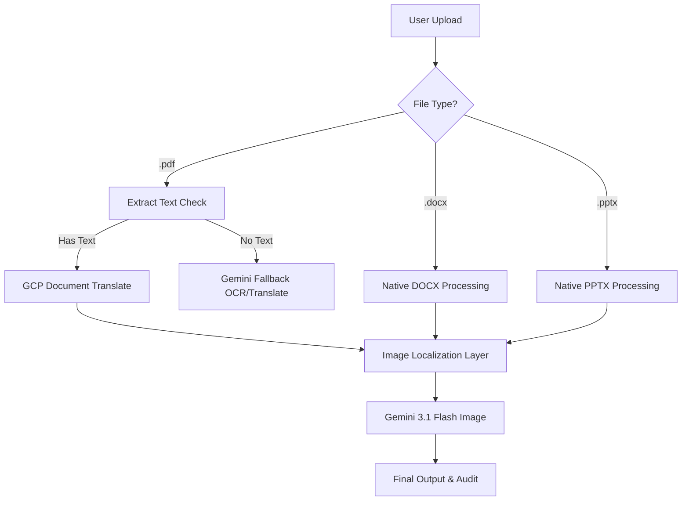

# 🚀 Financial Document Translation Agent (v3)

[](https://fastapi.tiangolo.com)
[](https://reactjs.org/)
[](https://vitejs.dev/)
[](https://deepmind.google/technologies/gemini/)

Expert document translation with **numerical precision**, **layout preservation**, and **terminology consistency**. This project handles complex financial reports across multiple formats, ensuring that both text and embedded graphics are perfectly localized.

---

## 🌟 Key Features

### 📄 Multi-Format Mastery
Seamlessly process and translate:
- **PDF Documents** (Vector and Scanned)
- **Word Documents** (`.docx`)
- **PowerPoint Presentations** (`.pptx`)

### 🧠 AI-Powered Image Localization
Leverages **Gemini 3.1 Flash Image** to:
- Detect text embedded within images, charts, and diagrams.
- Translate the text while preserving the original visual style, colors, and layout.
- Re-insert the translated image back into the document.

### 🔄 Hybrid Translation Pipeline
Combines the strengths of two world-class systems:
1. **Google Cloud Translation API**: Handles core text translation with layout preservation and glossary enforcement.
2. **Gemini Multi-Modal Fallback**: Automatically kicks in for scanned pages or documents with non-selectable text.

---

## 🛠️ Architecture



---

## 🚀 Quick Start

### Prerequisites
- Python 3.10+
- Node.js & npm
- Google Cloud Project with **Cloud Translation API** enabled.

### Installation

1. **Clone and Navigate**:
   ```bash
   cd "UP_Demos/translation-v3"
   ```

2. **Setup Backend**:
   ```bash
   pip install -r requirements.txt
   ```

3. **Setup Frontend**:
   ```bash
   cd frontend
   npm install
   cd ..
   ```

### Running Locally

Start both services with a single command:
```bash
bash run.sh
```

- **Dashboard**: `http://localhost:5175`
- **API Endpoint**: `http://localhost:8002`

---

## 📁 Project Structure

| File/Folder | Description |
| :--- | :--- |
| `main.py` | ADK Agent definition and workflow instructions. |
| `translator_tool.py` | Core translation logic and Gemini image processing. |
| `audit_tool.py` | Multi-format text extraction utilities. |
| `server.py` | FastAPI backend orchestrator. |
| `frontend/` | React/Vite verification dashboard. |

---

## 📋 Deployment Checklist
- [ ] Enable **Cloud Translation API** in GCP.
- [ ] Ensure `GOOGLE_CLOUD_PROJECT` is set in your environment.
- [ ] (Optional) Upload glossary CSVs to a GCS bucket for enterprise terminology enforcement.
